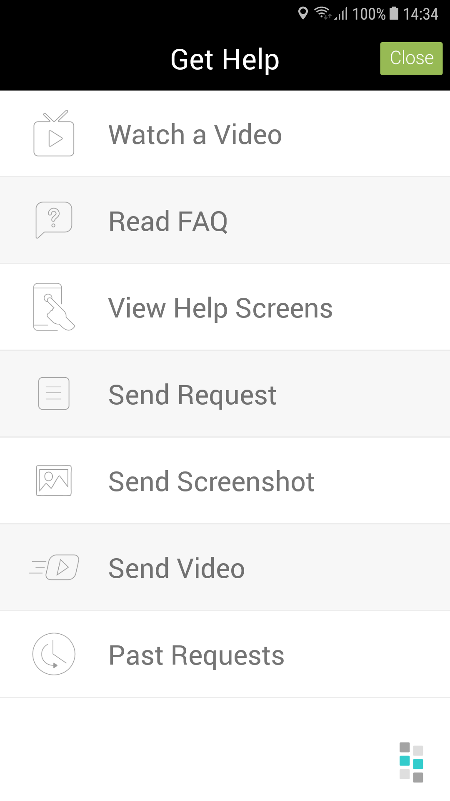

<h1>Introduction</h1>

Backbone Bits is an amazing tool to pitch your app to the major mobile platforms that are effective for both new and existing apps.
This documentation will help you to add and configure your apps with Backbone Bits tool. You can gain deep insight and easily respond all of your apps very quickly and with little effort using Backbone Bits's Android SDK. The SDK integration process is designed to be as easy as possible with a basic setup complete in under 5 minutes.


<h1>Screenshots</h1>




<h1>Features</h1>

- <b>Respond </b> - Communicate efficiently with in-app user interactions.
- <b>Help </b>- Help images, videos, and FAQs.
- <b>Supports</b> -Android 4.0 and up


<h1>Getting Started</h1>


> 1. Initialise Backbonebits. You can enable or disable helper on device shake 
```
Backbonebits b  = new Backbonebits(this);
        b.isShakeEnabled(true); //Default true     
```

> 2. You can open helper on click of view in your application: 

```
view.setOnClickListener(new View.OnClickListener() {
       @Override
    public void onClick(View v) {
        b.openBackbonebitsHelper();
    }
});
```


> 3.Copy API Key from Backbonebits  backend and put in your apps manifest file: 

```
<meta-data
    android:name="BackbonebitsAPIKey"
    android:value="Enter your api key" />
```


> 4. Import-Module Backbonebits to your project.Add following code to your Gradle file.

```
 compile project(':Backbonebits')
```

> If your application has Application class then add following in manifest.xml file.
```
<application tools:replace="android:name" android:name=".BackbonebitsUILApplication">
```

>  
```
public class BackbonebitsSampleApp extends BackbonebitsUILApplication { 
    // add your code here
}
```

<h1>Configure Push Notification:</h1>

1. Register your application in Firebase Console(https://console.firebase.google.com/)
2. Register Legacy server key in App Notification section.
3.Client app module who will be using this library module will have google-services.json file in this directory and not in library module directory.
4. Client app module gradle will be having below the line in it and not in library module gradle:
apply plugin: 'com.google.gms.google-services'
5. Make sure all the firebase dependencies are using same latest version.
6. Write the following line of code in the main project  manifeast.xml file


```
<!--
        To integrate FCM
-->
        <service
            android:name="com.backbonebits.fcm.MyFirebaseMessagingService">
            <intent-filter>
                <action android:name="com.google.firebase.MESSAGING_EVENT"/>
            </intent-filter>
        </service>
        <service
            android:name="com.backbonebits.fcm.MyFirebaseInstanceIDService">
            <intent-filter>
                <action android:name="com.google.firebase.INSTANCE_ID_EVENT"/>
            </intent-filter>
        </service>
```


> To Open All Past Generated Reports in Your Project : 

```
List<BackboneGetCommunicatrRequestResponse.CommunicatrData> reportList = b.openPastReports();
```


> To Show Past Requests Unread Count in Your Project: 

```
int count = b.getUnreadCount();
```


<h1>Bugs and Feedback</h1>

For bugs, questions and discussions please use the Github Issues.

<br>
<h1>License</h1>

  The MIT License (MIT)
  <br><br>
  Copyright (c) 2018 Intuz Solutions Pvt Ltd.
  <br/><br/>
  Permission is hereby granted, free of charge, to any person obtaining a copy of this software and associated documentation files
  (the "Software"), to deal in the Software without restriction, including without limitation the rights to use, copy, modify,
  merge, publish, distribute, sublicense, and/or sell copies of the Software, and to permit persons to whom the Software is
  furnished to do so, subject to the following conditions:
<br/><br/>
  THE SOFTWARE IS PROVIDED "AS IS", WITHOUT WARRANTY OF ANY KIND, EXPRESS OR IMPLIED, INCLUDING BUT NOT LIMITED TO THE WARRANTIES OF
  MERCHANTABILITY, FITNESS FOR A PARTICULAR PURPOSE AND NONINFRINGEMENT. IN NO EVENT SHALL THE AUTHORS OR COPYRIGHT HOLDERS BE
  LIABLE FOR ANY CLAIM, DAMAGES OR OTHER LIABILITY, WHETHER IN AN ACTION OF CONTRACT, TORT OR OTHERWISE, ARISING FROM, OUT OF OR IN
  CONNECTION WITH THE SOFTWARE OR THE USE OR OTHER DEALINGS IN THE SOFTWARE.
<br/>
<h1>More Open Source by Intuz</h1>

 <br/>
 <a href="https://github.com/Intuz-production/Backbone-bits-iOS" target="_blank">Backbone bits iOS SDK</a>
<br/>
<a href="https://github.com/Intuz-production/Backbone-bits-PHP" target="_blank">Backbone bits PHP SDK</a>
 
 <br/> <br/>

<a href="https://www.intuz.com/" target="_blank"></a>
